# Generative AI: A Complete Tutorial

> A beginner-friendly guide to understanding Generative AI, Machine Learning, Deep Learning, and how they work behind the scenes.

---

## Table of Contents

1. [Introduction: What is Generative AI?](#1-introduction-what-is-generative-ai)
2. [The Grandparent Analogy](#2-the-grandparent-analogy)
3. [AI vs Machine Learning vs Deep Learning](#3-ai-vs-machine-learning-vs-deep-learning)
4. [Traditional AI vs Generative AI](#4-traditional-ai-vs-generative-ai)
5. [How Generative AI Works Behind the Scenes](#5-how-generative-ai-works-behind-the-scenes)
6. [The Three Pillars of Generative AI](#6-the-three-pillars-of-generative-ai)
7. [Complete Summary](#7-complete-summary)
8. [Glossary](#8-glossary)

---

## 1. Introduction: What is Generative AI?

**Generative AI** is a type of artificial intelligence that can **create new content** — text, images, videos, code, music, and more — based on patterns it has learned from massive amounts of data.

### Simple Definition

> Generative AI learns patterns from existing data and generates entirely new content based on user requests.

### Examples of Generative AI Tools

| Tool | Type | What It Does |
|------|------|--------------|
| ChatGPT | Text | Generates conversations, essays, code |
| DALL-E | Images | Creates images from text descriptions |
| Gemini | Multi-modal | Text, images, code, and more |
| Midjourney | Images | Artistic image generation |
| GitHub Copilot | Code | Writes and suggests code |

---

## 2. The Grandparent Analogy

To understand Generative AI, imagine your **grandparents telling stories**.

### How Grandparents Tell Stories

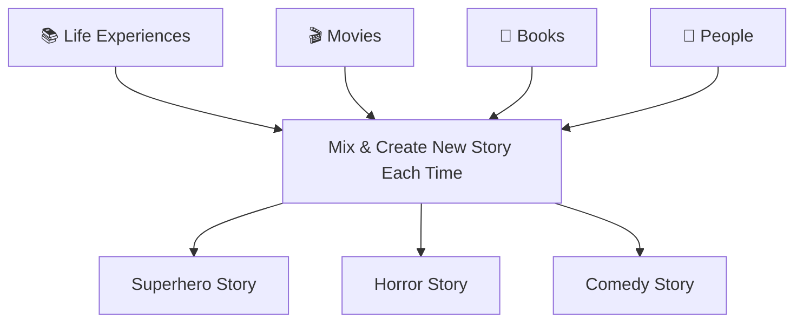

### Key Similarities Between Grandparents and Generative AI

| Aspect | Grandparent | Generative AI |
|--------|-------------|---------------|
| **Training** | Life experiences, stories heard | Massive text, images, videos, code |
| **Output** | Creates new version of stories | Generates new content |
| **Adaptation** | Changes tone based on child's age/mood | Adapts to context and prompts |
| **Process** | Mixes ideas, adds emotions | Predicts patterns mathematically |

### Key Difference

| Grandparent | Generative AI |
|-------------|---------------|
| Has consciousness | No consciousness |
| Feels emotions | No emotions |
| Has lived experiences | No lived experiences |
| Has intent | No intent |
| Tells from experience | Predicts patterns mathematically |

---

## 3. AI vs Machine Learning vs Deep Learning

Think of these as **nested concepts** — each one builds on the previous:

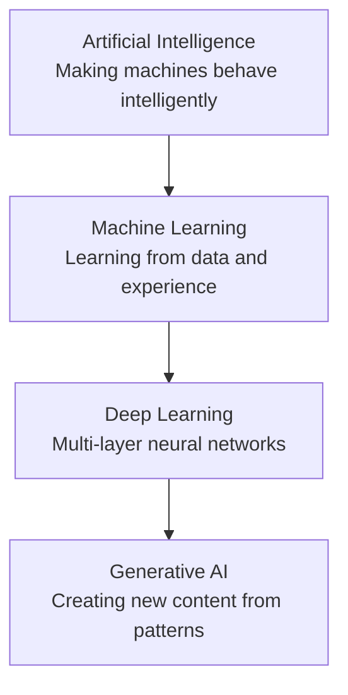

### 3.1 Artificial Intelligence (AI)

**Definition:** The overall goal of making machines behave intelligently like humans.

**Example: StoryVerse App (Basic Version)**
- Understands child's request
- Responds intelligently
- Adapts storytelling style
- Generates personalized outputs

### 3.2 Machine Learning (ML)

**Definition:** Teaching machines to learn from data and experience instead of explicitly programming every rule.

**How It Works:**

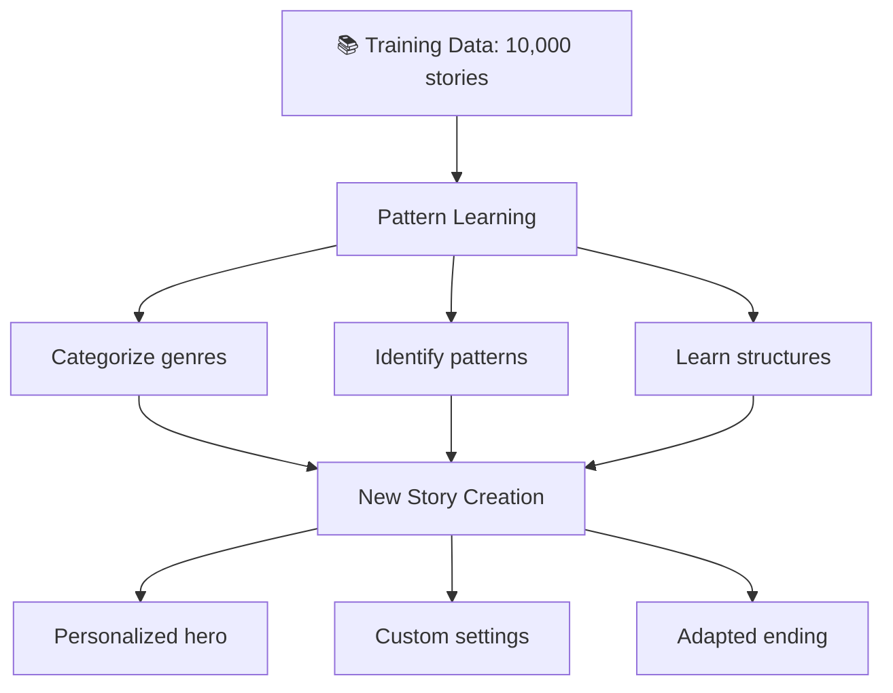

### 3.3 Deep Learning (DL)

**Definition:** An advanced form of machine learning using multiple neural network layers to solve highly complex problems.

**Multi-Layer Processing:**

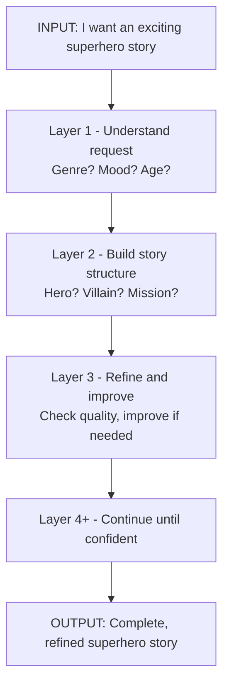

**Key Point:** This process repeats for **every single word** until the AI is confident about the output.

---

## 4. Traditional AI vs Generative AI

### 4.1 Traditional AI (Discriminative)

**What it does:**
- Classifies information
- Predicts outcomes
- Recognizes patterns
- Analyzes existing information

**Real-World Example: Netflix Recommendations**

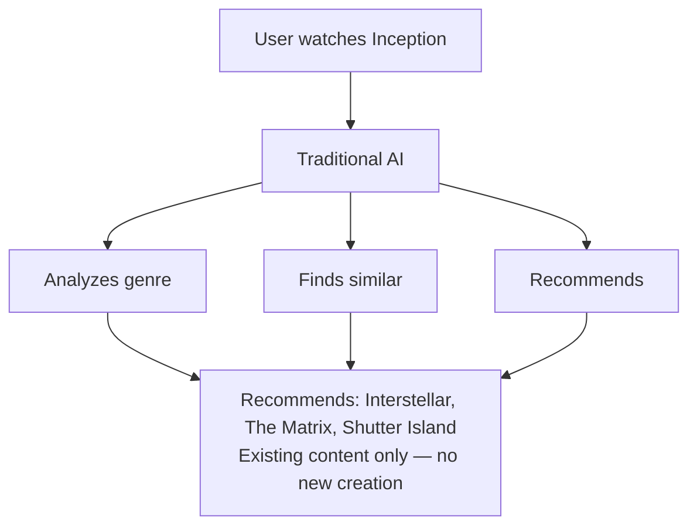

### 4.2 Generative AI

**What it does:**
- Creates new content
- Learns patterns to generate
- Produces original outputs
- Goes beyond existing data

**Example: Upgraded StoryVerse**

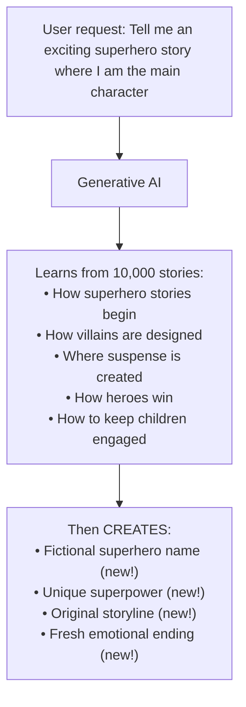

### 4.3 Comparison Table

| Aspect | Traditional AI | Generative AI |
|--------|---------------|---------------|
| **Primary Function** | Analyze & Classify | Create & Generate |
| **Output** | Existing content | New content |
| **Examples** | Netflix, Spam filters | ChatGPT, DALL-E |
| **Creativity** | None | High |
| **Training Goal** | Recognize patterns | Generate patterns |

---

## 5. How Generative AI Works Behind the Scenes

### 5.1 The Five Stages

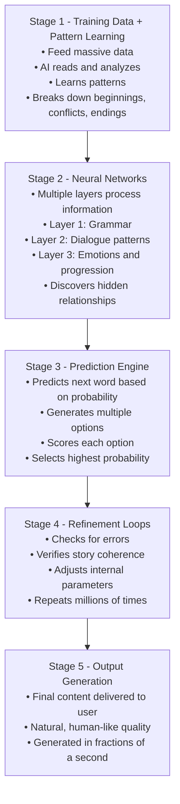

### 5.2 The Prediction Process (Word by Word)

**Example Input:** "Once upon a time, a lonely astronaut discovered..."

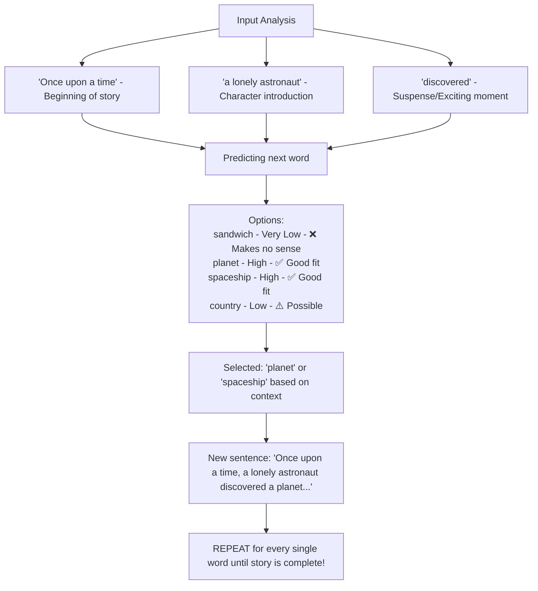

---

## 6. The Three Pillars of Generative AI

### 6.1 Data (The Foundation)

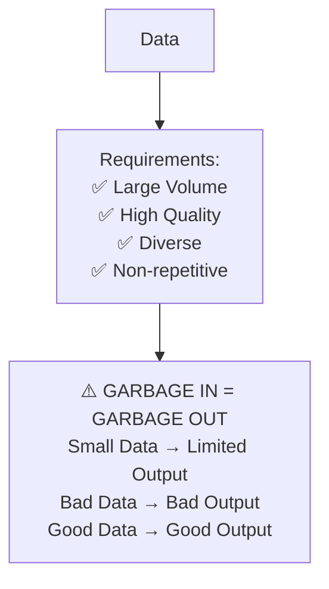

### 6.2 Computing Power (The Engine)

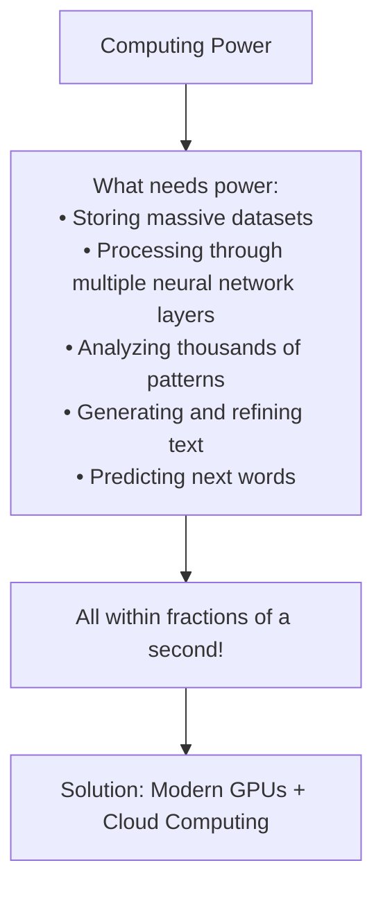

### 6.3 Conversational Interaction (The Interface)

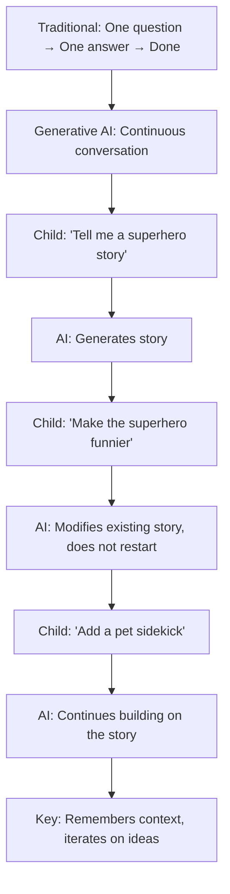

---

## 7. Complete Summary

### 7.1 The Full Picture

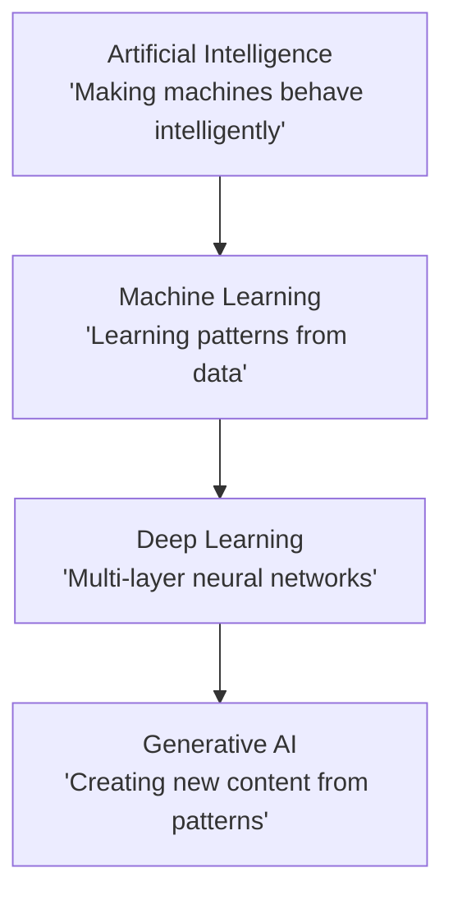

### 7.2 Key Takeaways

| Concept | One-Line Summary |
|---------|------------------|
| **Generative AI** | Creates new content by learning patterns |
| **Artificial Intelligence** | Making machines behave intelligently |
| **Machine Learning** | Learning from data instead of explicit programming |
| **Deep Learning** | Multi-layer neural networks for complex tasks |
| **Neural Networks** | Layered processing inspired by human brain |
| **Training Data** | The foundation — quality and quantity matter |
| **Prediction** | Guessing next word based on probability |
| **Refinement** | Improving output through repeated loops |

### 7.3 The Learning Path

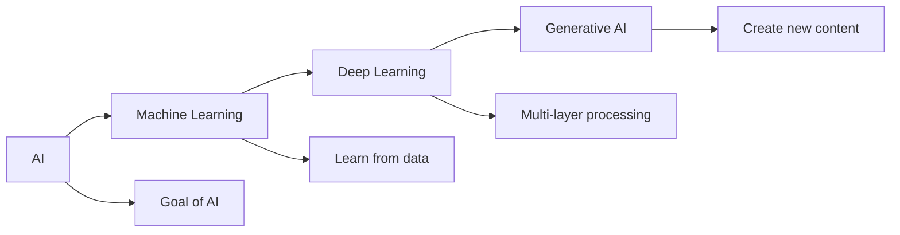

---

## 8. Glossary

| Term | Definition |
|------|------------|
| **Artificial Intelligence (AI)** | Making machines behave intelligently like humans |
| **Machine Learning (ML)** | Teaching machines to learn from data and experience |
| **Deep Learning (DL)** | Advanced ML using multiple neural network layers |
| **Neural Network** | Computing system inspired by biological brain neurons |
| **Training Data** | The dataset used to teach AI patterns |
| **Generative AI** | AI that creates new content from learned patterns |
| **Prediction** | AI's guess for the next word/token based on probability |
| **Refinement Loop** | Process of improving output through repeated iterations |
| **Context** | Information AI remembers during conversation |
| **Token** | A piece of text (word or part of word) that AI processes |

---

## Quick Reference Card

| Question | Answer |
|----------|--------|
| **What is Generative AI?** | AI that creates new content from learned patterns |
| **How does it work?** | Training Data → Pattern Learning → Neural Networks → Prediction → Refinement → Output |
| **What are the 3 pillars?** | Data (quality + quantity), Computing Power (GPUs + Cloud), Conversational Interaction (context + iteration) |
| **Key difference from Traditional AI?** | Traditional: Analyzes existing content. Generative: Creates new content. |

---

*This is based on a storytelling analogy to make Generative AI concepts accessible to everyone. Happy learning!*
